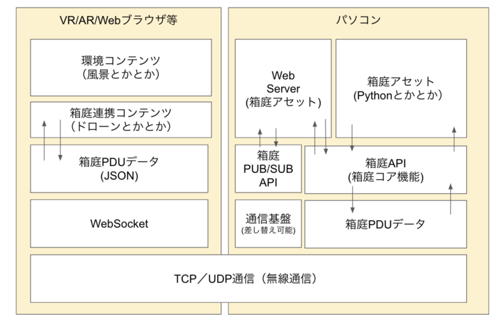

# hakoniwa-webserver

このリポジトリでは、箱庭PDUデータをWebソケットベースでアクセスできるようにするためのWebサーバーを提供します。

WebサーバーはPythonスクリプトで実装しています。

# 動作環境

* Ubuntu 22.0.4
* MacOS(AppleSilicon)
* Python: 3.12以降

# アーキテクチャ



# インストール

箱庭Webサーバーを利用するには、以下のオペレーションが必要です。

1. [箱庭コア機能のインストール](https://github.com/toppers/hakoniwa-core-cpp-client?tab=readme-ov-file#%E3%82%A4%E3%83%B3%E3%82%B9%E3%83%88%E3%83%BC%E3%83%AB%E6%89%8B%E9%A0%86)
2. Pythonライブラリのインストール

```
pip install -r requirements.txt
```

# 箱庭Webサーバー起動方法

箱庭Webサーバーを起動するには、箱庭コンダクタが起動されている必要があります。

以下、箱庭Webサーバーの起動方法です。

```
python3.12 server/main.py --asset_name WebServer --config_path config/custom.json --delta_time_usec 20000
```

# Webブラウザからのアクセス方法

Webブラウザからアクセスするには、以下のURLを入力すればOKです。

URL: `http://localhost:8000` 

# サンプル

## 箱庭ドローンシミュレータをWebブラウザでビジュアライズ

箱庭ドローンシミュレータをインストール済みであれば、Webブラウザ連携は容易に実現できます。

### 事前準備

以下のサイトから、`static.webgl.zip` をダウンロードします。

https://github.com/toppers/hakoniwa-unity-drone-model/releases/tag/v2.1.1

static.webgl.gz を解凍し、以下の構成で配置します。

```
hakoniwa-webserver
└── server
    └─── static.webgl
       └─── Build
        │   ├── static.webgl.data.gz
        │   ├── static.webgl.framework.js.gz
        │   ├── static.webgl.loader.js
        │   └── static.webgl.wasm.gz
        └─── TemplateData
            ├── MemoryProfiler.png
            ├── favicon.ico
            ├── fullscreen-button.png
            ├── progress-bar-empty-dark.png
            ├── progress-bar-empty-light.png
            ├── progress-bar-full-dark.png
            ├── progress-bar-full-light.png
            ├── style.css
            ├── unity-logo-dark.png
            ├── unity-logo-light.png
            ├── webgl-logo.png
            └── webmemd-icon.png
```

### 実施手順

端末A：
```
cd hakoniwa-px4sim/hakoniwa
```

```
bash drone-web.bash ../../hakoniwa-unity-drone-model config/rc
```

端末B：
```
cd hakoniwa-px4sim/drone_api/sample
```

```
python3.12 rc-custom.py ../../../hakoniwa-unity-drone-model/custom.json ./rc_config/ps4-control.json
```

端末C：
```
python3.12 server/main.py --asset_name WebServer --config_path config/custom.json --delta_time_usec 20000
```
